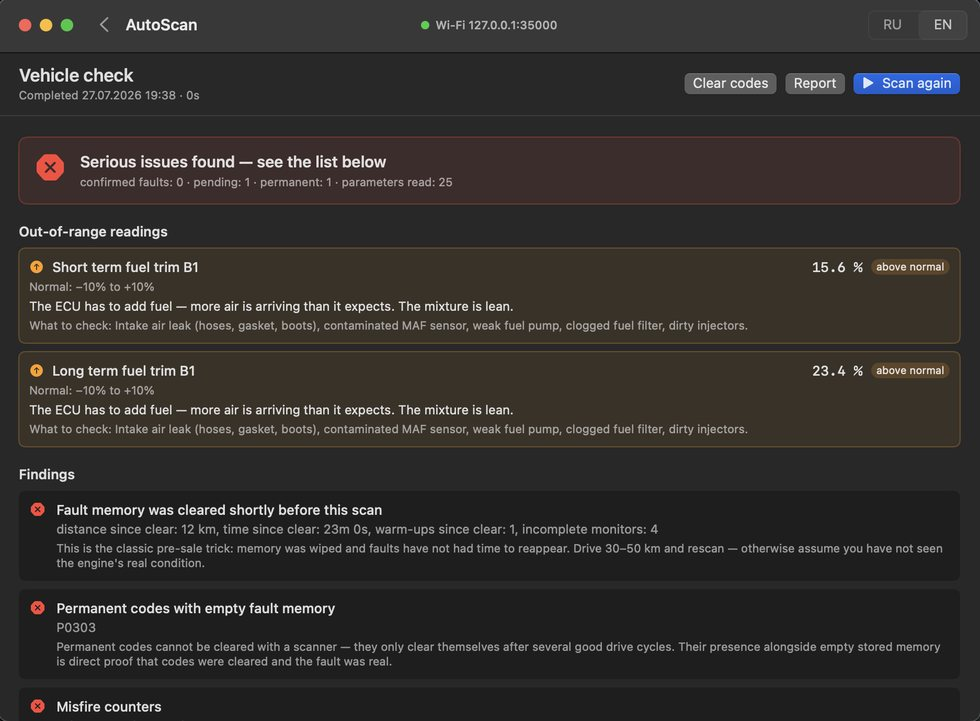
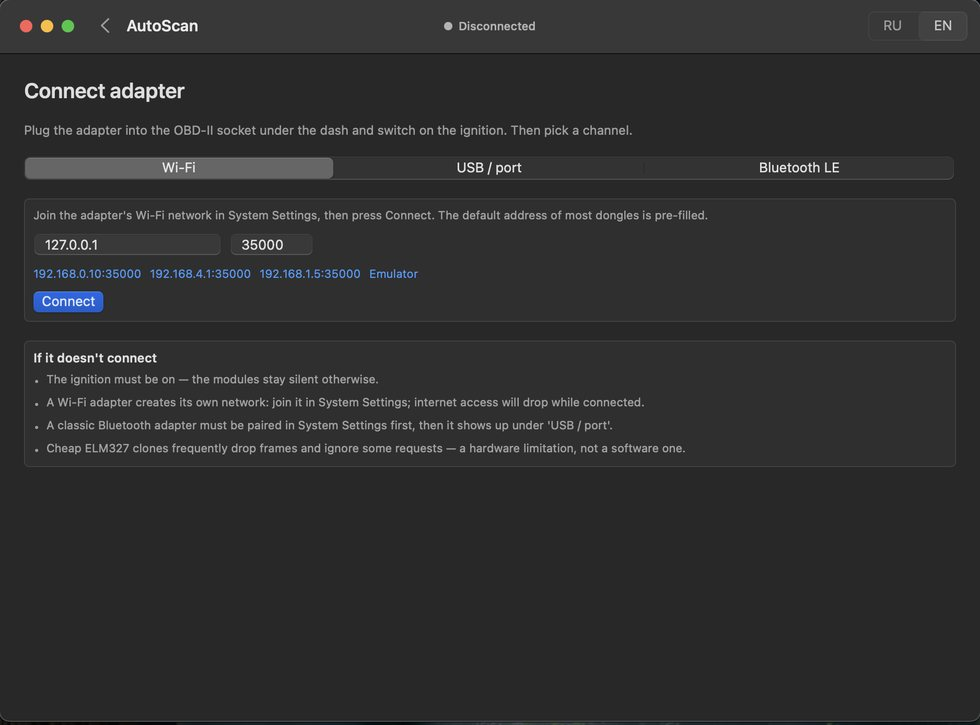
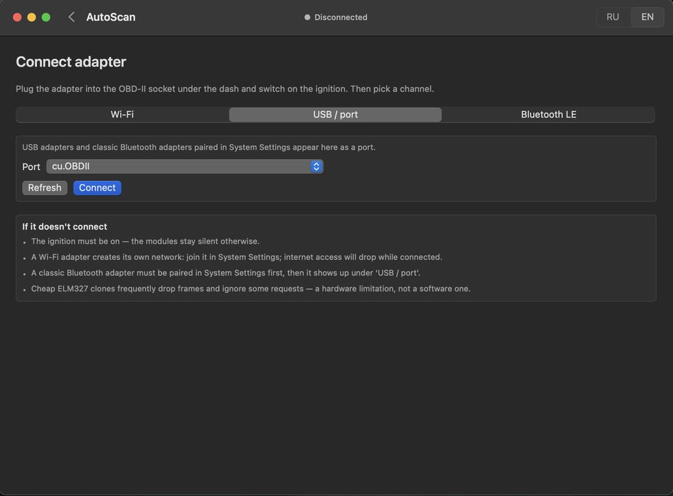
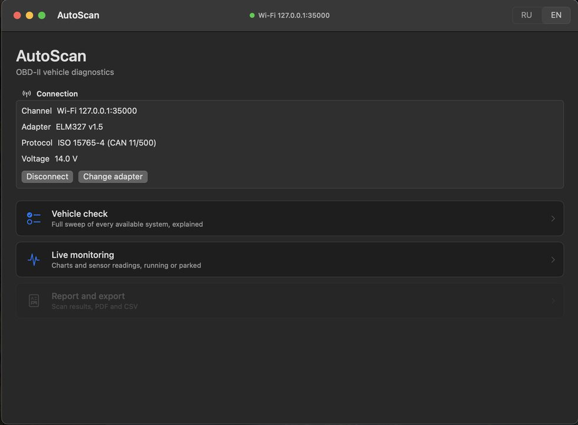
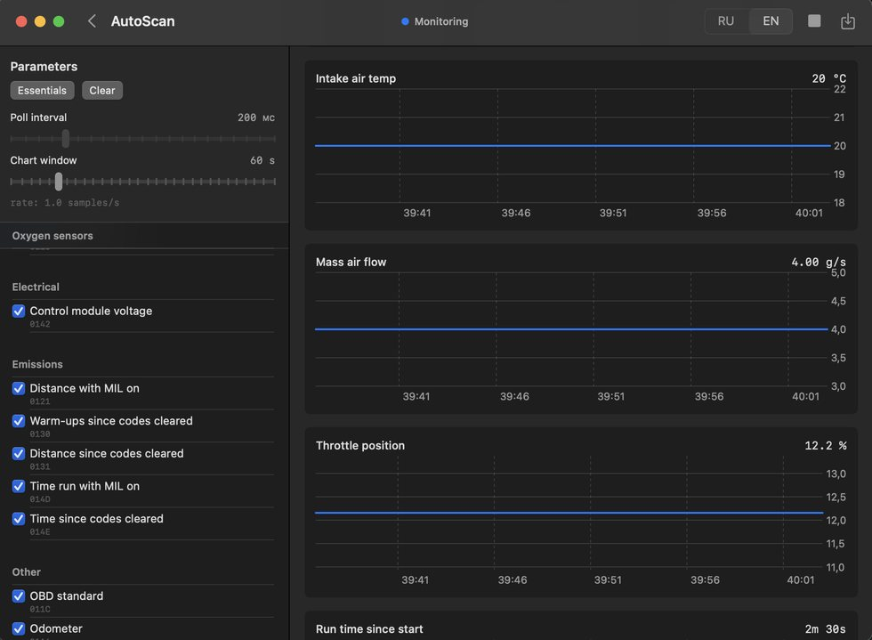
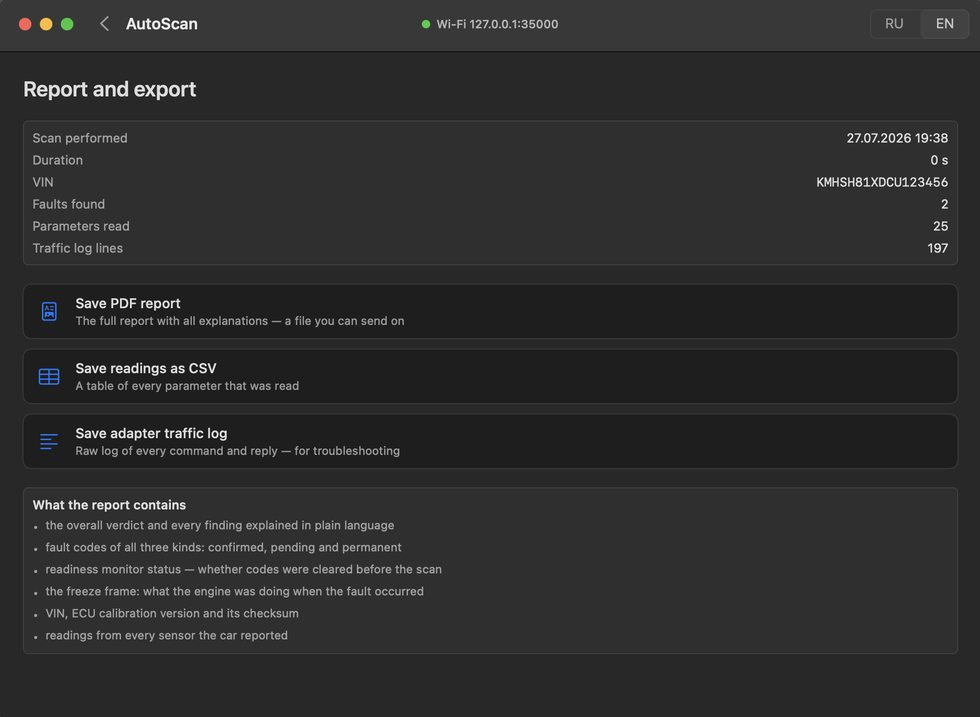

# AutoScan

**A native macOS car diagnostics app that talks to a real ECU over OBD-II — and tells you if someone wiped the fault codes before selling you the car.**

Plug an ELM327 adapter into the car's OBD-II port, connect over Wi-Fi, USB or Bluetooth LE, and AutoScan interrogates the engine control unit: supported parameters, fault codes, readiness monitors, freeze frames, on-board test results, misfire counters, VIN and firmware identity. Then it draws conclusions — in plain language, with evidence.

Written in Swift with **zero external dependencies**. Three transport layers implemented from scratch on BSD sockets, termios and CoreBluetooth.

🇷🇺 [Русская версия README](README.ru.md)

---

## Screenshots

**The verdict** — this is what the app exists for. Fault memory cleared 12 km and 23 minutes before the scan, four monitors still incomplete, and a permanent code sitting in a module whose main fault memory reads empty:



| Wi-Fi adapter | USB / serial port |
|---|---|
|  |  |

Once connected, the app reports what it actually negotiated — adapter firmware, the protocol the ECU agreed on, and battery voltage straight off the pin:



| Live monitoring | Export |
|---|---|
|  |  |

## The problem it solves

A seller clears the check-engine light an hour before you arrive. The dash is clean, the car looks fine, and the fault comes back a week later.

AutoScan catches this. Not by reading a single flag — the ECU doesn't have one — but by cross-referencing independent evidence:

- **distance since codes were cleared** (PID 0x31) under 100 km
- **time since cleared** (PID 0x4E) under 120 minutes
- **warm-up cycles since cleared** (PID 0x30) fewer than 5
- **and** two or more readiness monitors still incomplete

Any one of those is weak. Together they are conclusive, and the app says so. Separately, **permanent codes** (Mode 0A) that survive an erase while Mode 03 reads empty are direct proof that something was wiped.

The same approach catches odometer tampering: mileage (PID 0xA6) divided by ignition cycle count (Mode 09 PID 08) gives average trip length. Above 60–70 km per start on a city car, the numbers don't add up.

## Try it without a car

The repository ships with an ECU emulator. It impersonates a Wi-Fi ELM327 dongle byte for byte — AT command handling, echo state, the `>` prompt, and multi-frame CAN response formatting.

```bash
python3 Tools/mock_ecu.py --profile suspicious
```

Then in the app: **Connect adapter → Wi-Fi → "Emulator" preset → Connect**.

Two profiles: `suspicious` (a freshly-cleared car with cylinder 3 misfires and a tampered odometer) and `clean` (a healthy one). Mode 04 in the emulator actually mutates state, so "erase codes" can be verified end to end.

There is also a headless run of the full cycle — same code path as the UI, prints the whole report to the terminal, generates a PDF, checks it, and exits with a status code:

```bash
AutoScan.app/Contents/MacOS/AutoScan --selftest tcp:127.0.0.1:35000
```

## The interesting parts

### Three transports, one protocol

```swift
protocol Transport {
    func open() async throws
    func write(_ data: Data) throws
    func readAvailable() -> Data
    func close()
}
```

Behind that interface sit three completely different mechanisms, all hand-written:

**TCP** — on raw BSD sockets, not `URLSession` and not `Network.framework`. `getaddrinfo` with a walk through every `addrinfo` in the chain, `setsockopt(SO_RCVTIMEO)` so the reader thread can't hang, `TCP_NODELAY`, a dedicated reader thread handling `EAGAIN` / `EINTR` / `n == 0`, and a partial-write loop.

**Serial** (USB and Bluetooth classic SPP) — termios configured by hand: `open(O_RDWR|O_NOCTTY|O_NONBLOCK)`, `ioctl(TIOCEXCL)` to claim the port, `cfmakeraw`, baud rate, clearing `PARENB` / `CSTOPB` / `CRTSCTS`, `tcsetattr(TCSANOW)`, `tcflush`. Ports are discovered by enumerating `/dev/cu.*`.

**BLE** — CoreBluetooth bridged to `async` through `withCheckedThrowingContinuation`, with a 20-second open timeout, automatic write/notify characteristic discovery, and **MTU-aware chunking** via `maximumWriteValueLength(for:)`. Device identification uses five known OBD service UUIDs plus name heuristics, ranked by likelihood and signal strength.

Switching transports is one line at the call site.

### A binary protocol, defensively parsed

The adapter speaks ELM327 AT commands; the ECU speaks SAE J1979. Neither is well-behaved.

`assemble()` handles what actually comes back: multi-frame CAN responses arriving as `0:` / `1:` prefixed lines that must be sorted and stitched, error strings (`NO DATA`, `CAN ERROR`, `BUS ERROR`, `STOPPED`, `UNABLE TO CONNECT`) mixed into the stream, command echo, and negative responses (`0x7F`) that carry a numeric reason code.

Capability discovery is done properly — the app asks the car which PIDs it supports by walking bitmasks (0x00, 0x20, 0x40 …, bit 0 meaning "another group follows") instead of assuming a fixed list. `DTCDecoder` implements two payload parsings and picks the one that yields sensible codes, because real modules disagree about whether to include a count byte.

### Concurrency, each tool where it belongs

- **`actor ELM327`** — an adapter physically cannot process two commands at once, and the actor makes that a compile-time guarantee rather than a convention
- **`@MainActor VehicleSession`** — the single UI store
- **raw `Thread`** for the blocking socket and serial read loops, where GCD would be the wrong shape
- **`withCheckedThrowingContinuation`** to bridge CoreBluetooth delegates into `async`
- **cancellable `Task`** for the live monitoring loop
- **`@unchecked Sendable` + `NSLock`** on the transports and the RX buffer — a deliberate, documented opt-out

Timeouts exist at three levels: socket (`SO_RCVTIMEO`), BLE connection (20 s), and per-command deadlines (2–8 s depending on the command).

### It refuses to guess

Anything the app could not read goes into an explicit **"could not be read"** section of the report. No zeros substituted for missing sensors, no invented values. `Norms.assess()` evaluates readings **in engine context** — whether the engine is running, warm, idling — because a MAP or lambda reading means nothing without it.

## Features

| Screen | What it does |
|---|---|
| **Connection** | Wi-Fi (host/port with presets), USB/serial port list, BLE scan with signal strength |
| **Scan** | Full interrogation with staged progress, 10 result sections, NHTSA VIN lookup, expandable traffic log |
| **Monitor** | Live sensor graphs via Swift Charts, configurable window, samples/sec, CSV export |
| **Report** | Export to PDF, CSV or raw adapter log |

**OBD-II modes implemented:** 01 (live data + capability masks), 02 (freeze frame), 03/07/0A (confirmed / pending / permanent codes), 04 (erase), 06 (on-board tests including per-cylinder misfire counters), 09 (VIN, calibration ID, CVN, ECU name, in-use performance counters).

**Fault code database:** ~100 codes with bilingual plain-language explanations and severity. Unknown codes are decoded *structurally* — system from the leading letter, generic vs manufacturer from the second digit, subsystem from the group — so the app never shows a bare code with no meaning.

**PDF reports** are laid out page by page in CoreGraphics: A4, manual pagination, headings, key-value rows and automatic page breaks.

## Tech stack

- **Swift 6 toolchain** (`swift-tools-version: 6.0`, language mode 5), macOS 14+
- **SwiftUI** throughout, with AppKit for `NSSavePanel` and CoreGraphics for PDF generation
- **Frameworks:** Foundation, SwiftUI, CoreBluetooth, Combine, AppKit, UniformTypeIdentifiers, Swift Charts — plus POSIX (`socket`, `termios`, `ioctl`) via Darwin
- **Zero external dependencies** — `Package.swift` has no `dependencies` array at all
- **Fully bilingual** (RU/EN): every string, including error messages, the fault code database and the PDF report. Language is detected from `Locale.preferredLanguages`, switchable at runtime
- The only network call in the entire app is an optional VIN lookup against the public NHTSA vPIC API — no key required, triggered by an explicit button, because a Wi-Fi dongle usually means no internet

## Architecture

```
Sources/AutoScan/
├── Core/      # Transport protocol, TCP / Serial / BLE, RXBuffer, actor ELM327, errors
├── Data/      # 62 PID definitions with decoders, DTC database, readiness, VIN, norms
├── Engine/    # VehicleSession (@MainActor store), ScanReport, Verdict, SelfTest
├── Export/    # PDFReport — CoreGraphics page layout
├── UI/        # 5 SwiftUI screens + connection badge
└── L10n/      # Loc.t(ru, en) + LocalizationStore
Tools/
└── mock_ecu.py    # ELM327 + ECU emulator over TCP
```

`Entry.main()` intercepts `--selftest` before the SwiftUI `App` starts, so the same binary is both a GUI app and a CLI tool.

## Scale

22 Swift files · ~6,300 lines · 3 transports · 7 OBD-II modes · 62 PIDs · 92 fault codes · 2 languages

## Known trade-offs

- **No unit tests yet.** Coverage is currently an end-to-end smoke test (emulator + `--selftest`). The pure byte-parsing functions — `assemble()`, `DTCDecoder.codes()`, `PerformanceTracking.parse()` — are the obvious first targets.
- **No automatic reconnect.** On a transport error the connection drops to `.disconnected` and must be re-established by hand. For hardware that loses link, this should be handled.
- `ScanView.swift` is 758 lines and wants decomposition into per-section views.

## Scope

Generic OBD-II only — engine and emissions. ABS, SRS and transmission modules use manufacturer-specific protocols and are out of scope; the app says so rather than pretending otherwise. Cheap ELM327 clones drop frames and ignore some requests — when data reads intermittently, that is a hardware limitation, and the report names what it could not read.

## Build

```bash
./build_app.sh
open AutoScan.app
```

Requires macOS 14+ and a Swift 6 toolchain. The build script assembles the `.app` bundle with its `Info.plist` and applies an ad-hoc signature — needed for Bluetooth access.

---

## How this was built

Built with Claude, Anthropic's AI assistant, as a coding partner. I wrote the specification and the architecture constraints and ran the review cycle; the assistant wrote code against that spec. More on how I work: [github.com/comixcap](https://github.com/comixcap)
